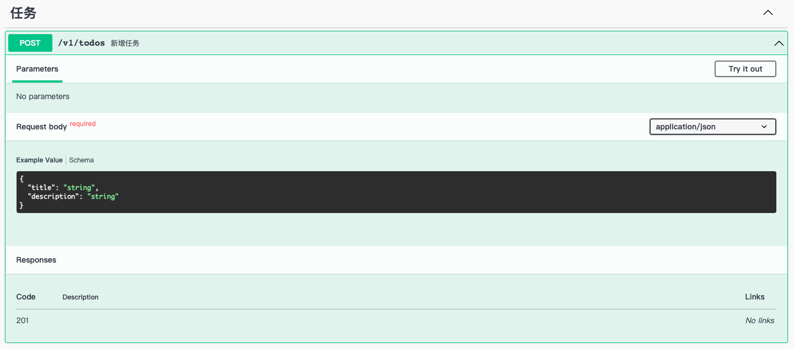
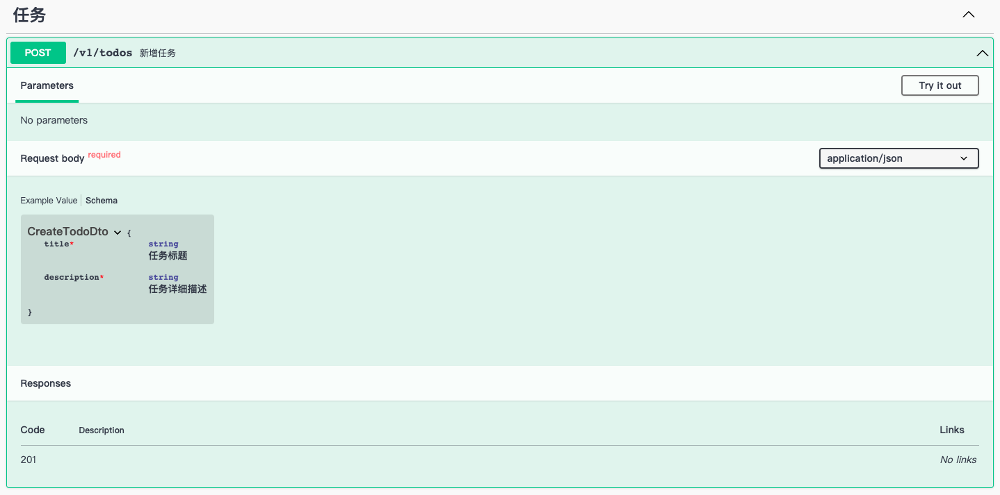

<h1 align="center">
  Nest.js 初探实战项目todo-demo (CRUD)
</h1>
<p align="center">
<a href="https://www.npmjs.com/~nestjscore" target="_blank"></a>
<a href="https://www.npmjs.com/~nestjscore" target="_blank"></a>
<a href="https://www.npmjs.com/~nestjscore" target="_blank"></a>
<a href="https://circleci.com/gh/nestjs/nest" target="_blank"></a>
<a href="https://coveralls.io/github/nestjs/nest?branch=master" target="_blank"></a>
<a href="https://discord.gg/G7Qnnhy" target="_blank"></a>
<a href="https://opencollective.com/nest#backer" target="_blank"></a>
<a href="https://opencollective.com/nest#sponsor" target="_blank"></a>
  <a href="https://paypal.me/kamilmysliwiec" target="_blank"></a>
    <a href="https://opencollective.com/nest#sponsor"  target="_blank"></a>
  <a href="https://twitter.com/nestframework" target="_blank"></a>
</p>
  <!--[](https://opencollective.com/nest#backer)
  [](https://opencollective.com/nest#sponsor)-->

## 项目简介
这是一个 Nest.js 初探实战的 todo-demo (CRUD) 项目，使用的技术栈为 Nest.js + TypeScript + TypeORM + Mysql + Swagger，适合完全不了解 Nest.js 的同学，可以对它有一个大概的印象。

## 项目背景
最近想学习 Nest.js, 但是一直没有找到合适的教程（到现在为止也没找到），因为对服务端了解太浅，啃官网也很费力。
最后找到了一个比较不错的<a href="https://note.buging.cn/nest/1-1.html">专栏</a>，参考这个专栏，算是初步了解了 Nest.js，开始入门服务端，未来还有很长的路要走。

## 项目预览
<br/>
<br/>
<br/>

## 运行项目

### 准备工作

1. 本地安装 mysql
2. 创建 todos 数据库
3. 我有可视化需求所以使用的 navicat，也可以选择不用

### 启动项目

#### Installation

```bash
$ yarn install
```

#### Running

```bash
# development
$ yarn start

# watch mode
$ yarn start:dev
```

此时，项目已经跑起来在 3000 端口了，浏览器访问 http://localhost:3000/docs 就可以查看 swagger 文档，可以尝试调取接口增删改查啦～